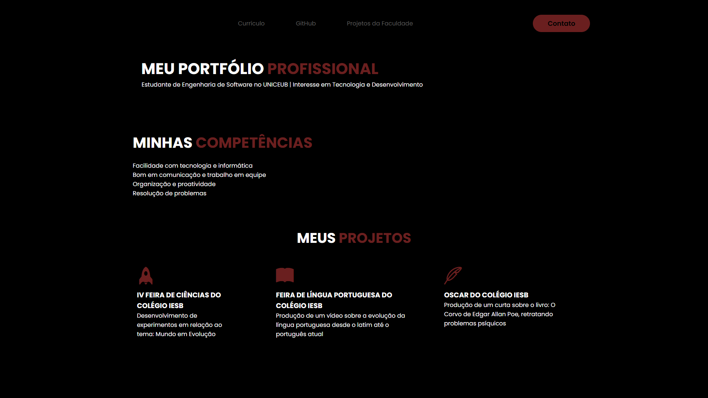

# 🌐 Portfólio Pessoal

Este é o meu portfólio pessoal, desenvolvido como parte do bootcamp da faculdade. O objetivo deste projeto é apresentar meus conhecimentos em HTML e CSS, além de destacar alguns dos meus projetos e habilidades.

## 🚀 Tecnologias Utilizadas

- HTML5
- CSS3

## 🎯 Objetivo

Criar uma página web simples, responsiva e visualmente agradável que represente minha identidade profissional, incluindo:

- Uma breve apresentação pessoal
- Uma lista de projetos desenvolvidos
- Links para redes sociais ou contato

## 📷 Prévia do Projeto

## 💡 Funcionalidades

- Layout responsivo
- Design moderno e limpo
- Seções organizadas: Sobre mim, Projetos, Contato

## 🛠️ Como visualizar o projeto

Entre no link: (https://d4viveras.github.io/Port-lio/) diretamente em seu navegador.

## ✍️ Autor

Desenvolvido por Davi Veras  
[LinkedIn: Davi Veras](https://www.linkedin.com/in/davi-veras-959a04360/)
